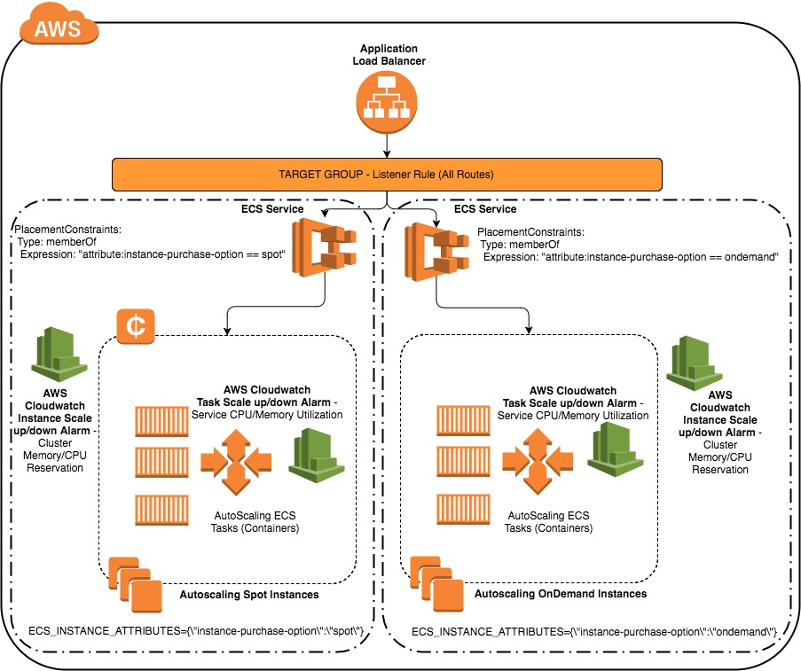

 

# Powering your Amazon ECS Cluster with a mix of Amazon EC2 Spot Instances and Amazon EC2 OnDemand Instances with independent AutoScaling

## **Background**

[AWS Elastic Compute Cloud (EC2) Spot instances](https://aws.amazon.com/ec2/spot/pricing/) provide you with access to unused Amazon EC2 capacity at steep discounts relative to On-Demand prices.  The Spot price fluctuates based on the supply and demand of available unused EC2 capacity.
When you request Spot instances, you specify the maximum Spot price you are willing to pay.  Your Spot instance is launched when the Spot price is lower than the price you specified, and will continue to run until you choose to terminate it or the Spot price exceeds the maximum price you specified.
The key differences between Spot instances and On-Demand instances are that Spot instances might not start immediately, the hourly price for Spot instances varies based on demand, and Amazon EC2 can terminate an individual Spot instance as the hourly price for, or availability of, Spot instances changes.

In order to overcome this problem, in this solution, I will walk through a design pattern and codebase, in which a mix of spot instances and on demand instances can be used to serve critical workloads on [Amazon EC2 Container Service (ECS)](https://aws.amazon.com/ecs/) in conjunction with [AWS AutoScaling](https://aws.amazon.com/autoscaling/).

## **Solution**



In this solution, two [ECS clusters](http://docs.aws.amazon.com/AmazonECS/latest/developerguide/ECS_clusters.html) are used, one using spot instances and another using on-demand instances.
Separating the two clusters based on the pricing options gives an opportunity to harness [cluster reservation metrics](http://docs.aws.amazon.com/AmazonECS/latest/developerguide/cloudwatch-metrics.html#cluster_reservation).
AutoScaling adds one instance to the respective cluster, if the cluster CPUReservation and/or MemoryReservation [AWS CloudWatch](https://aws.amazon.com/cloudwatch/) metrics exceed 70%, thereby ensuring sufficient capacity to run the tasks.

Both the clusters run individual [ECS Services](http://docs.aws.amazon.com/AmazonECS/latest/developerguide/ecs_services.html) which allows to maintain desired numbers of instances of a specific [ECS Task definition](http://docs.aws.amazon.com/AmazonECS/latest/developerguide/task_definitions.html).
Autoscaling adds one more instance of the task definition by increasing [desiredCount](http://docs.aws.amazon.com/AmazonECS/latest/developerguide/service_definition_paramters.html) by one, if the service [CPUUtilization and/or MemoryUtilization](http://docs.aws.amazon.com/AmazonECS/latest/developerguide/cloudwatch-metrics.html#service_utilization) metrics exceeds 70% .

Both the ECS Services run behind the same [Application Load Balancer](https://aws.amazon.com/elasticloadbalancing/applicationloadbalancer/)
For the cluster, which runs spot instances, AutoScaling places the bid for spot instances and if it gets fulfilled, the instance is added to the cluster and tasks will be placed to run on the instances using "spread" [ECS Task placement strategy](http://docs.aws.amazon.com/AmazonECS/latest/developerguide/task-placement-strategies.html).
If the bid price gets beaten up by the market price , the spot instances will get terminated, resulting in increase of Memory Utilization/CPU Utilization Metrics, due to increased load on tasks running on on-demand instances. Once Memory Utilization/CPU Utilization Metrics breaches the threshold (set to 70%) , ECS Service adds one more instance of the task definition at on-demand instances, which then increases the
cluster CPUReservation and/or MemoryReservation. Finally, once cluster CPUReservation and/or MemoryReservation metrics breaches the threshold (set to 70%), AutoScaling adds one more instance (on-demand)to the cluster running .

In the same way, AutoScaling removes one instance from the respective clusters, if the cluster CPUReservation and/or MemoryReservation metrics dips below 20%, thereby removing excess capacity to run the tasks.
A shell script (created at the userdata during the instance bootstrap) listens to the termination notices sent to the spot instances in order set the ECS container instance in DRAINING state.
ECS Service AutoScaling decreases desiredCount by one, if the service CPUUtilization and/or MemoryUtilization metrics dips below 20%.


## **Pre-Requisites**
This example uses [AWS Command Line Interface](http://docs.aws.amazon.com/cli/latest/userguide/cli-chap-welcome.html) to run Step-2 below.
Please follow [instructions](http://docs.aws.amazon.com/cli/latest/userguide/installing.html) if you haven't installed AWS CLI.
Your CLI [configuration](http://docs.aws.amazon.com/cli/latest/userguide/cli-chap-getting-started.html) need PowerUserAccess and IAMFullAccess [IAM policies](http://docs.aws.amazon.com/IAM/latest/UserGuide/access_policies.html) associated with your credentials

```console
aws --version
```

Output from above must yield **AWS CLI version >= 1.11.37**

## **Deployment**


#### 1. Clone the repository

```console
git clone https://github.com/aws-samples/ecs-refarch-mixed-mode.git
```

#### 2. Run bin/deploy
```console
bin/deploy
```

Here are the inputs required to launch CloudFormation templates:
* **S3 Bucket**: Enter S3 Bucket for storing your CloudFormation templates and scripts. This bucket must be in the same region where you wish to launch all the AWS resources created by this example.
* **CloudFormation Stack Name**: Enter CloudFormation Stack Name to create stacks

Sit back and relax until all the resources are created for you. After the templates are created, you can open ELB DNS URL to see the ECS Sample App

## **Considerations**

* It is recommended to test your application under the expected/extrapolated load pattern to identify the scaling triggers.
* You can tweak MinTaskNumber property in spot-ondemand-ecs.yaml to decide the minimum number of instances of the task definition that will run at the respective clusters.
For optimized cost and ensuring spot instances are more in number as compared to on-demand instances, this count should be set higher in "SpotCluster" resource as compared with "OnDemandCluster" resource in spot-ondemand-ecs.yaml

## **Conclusion**
AWS Cloudwatch ECS Cluster CPUReservation and/or MemoryReservation metrics can be used to dynamically increase/decrease the instances running in an AutoScaling group.
Separating the two ECS clusters based on the pricing options gives an opportunity to harness cluster CPUReservation and/or MemoryReservation metrics and thus increase or decrease the number of instances


## Resources created in this exercise

Count | AWS resources
| --- | --- |
4   | [AWS CloudFormation templates](https://aws.amazon.com/cloudformation/)
1   | [Amazon VPC](https://aws.amazon.com/vpc/) (10.215.0.0/16)
2  | [Amazon ECS Cluster](https://aws.amazon.com/ecs/)
2  | [Amazon ECS Service](https://aws.amazon.com/ecs/)
1  | [t2.small EC2 on-demand instance](https://aws.amazon.com/ec2/pricing/on-demand/)
1  | [c3.large EC2 spot instance](https://aws.amazon.com/ec2/spot/pricing/)
1  | [Application Load Balancer](https://aws.amazon.com/elasticloadbalancing/applicationloadbalancer/)
1  | [Application Load Balancer Target Groups](https://aws.amazon.com/elasticloadbalancing/applicationloadbalancer/)


### Pricing

AWS CloudFormation is a free service; however, you are charged for the AWS resources you include in your stacks at the current rates for each. For more information about AWS pricing, go to the detail page for each product on [http://aws.amazon.com](http://aws.amazon.com).


## AWS services used

* [AWS CloudFormation](https://aws.amazon.com/cloudformation/)
* [Amazon EC2 Container Service (ECS)](https://aws.amazon.com/ecs/)
* [Amazon EC2 Spot Instances](https://aws.amazon.com/ec2/spot/)
* [Amazon EC2 OnDemand Instances](https://aws.amazon.com/ec2/pricing/on-demand/)
* [Amazon CloudWatch](https://aws.amazon.com/cloudwatch/)
* [Amazon Simple Notification Service (SNS)](https://aws.amazon.com/sns/)

## Contributing

Comments, feedback, and pull requests are always welcome.

## Authors

* [**Anuj Sharma**](https://github.com/anshrma)

## License

This project is licensed under the [Amazon Software License](https://aws.amazon.com/asl/) - see the [LICENSE.txt](LICENSE.txt) file for details.
